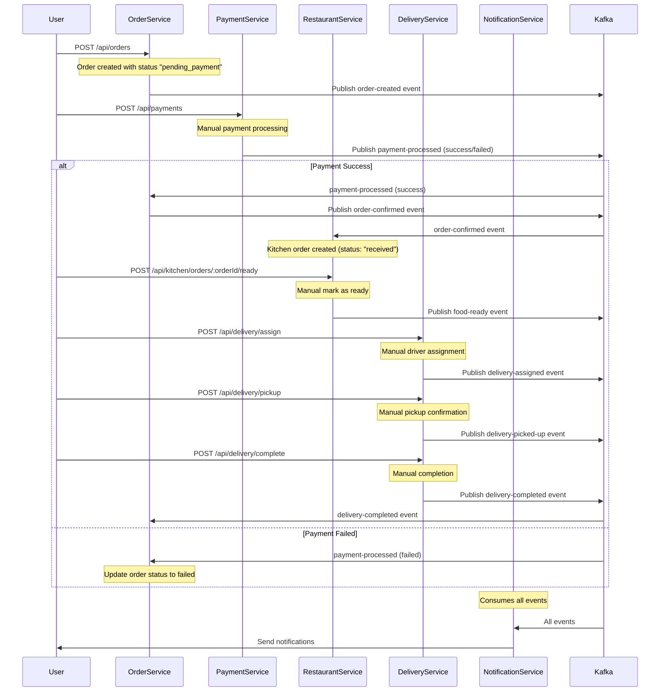

# Food Ordering Microservices System

A comprehensive microservices architecture for a food ordering system built with Node.js, Express, and Apache Kafka. This system demonstrates event-driven architecture, service communication patterns, and real-world microservices concepts.

## 🏗️ Architecture Overview

The system consists of 5 microservices that communicate through Kafka events:

```
┌─────────────────┐    ┌─────────────────┐    ┌─────────────────┐
│   Order Service │    │ Payment Service │    │ Restaurant Svc  │
│    Port: 5001   │    │    Port: 5002   │    │    Port: 5006   │
└─────────────────┘    └─────────────────┘    └─────────────────┘
         │                       │                       │
         └───────────────────────┼───────────────────────┘
                                 │
                    ┌─────────────────┐
                    │   Kafka Broker  │
                    │   Port: 9092    │
                    └─────────────────┘
                                 │
         ┌───────────────────────┼───────────────────────┐
         │                       │                       │
┌─────────────────┐    ┌─────────────────┐
│Delivery Service │    │Notification Svc │
│    Port: 5004   │    │    Port: 5003   │
└─────────────────┘    └─────────────────┘
```

## 🚀 Services

### 1. Order Service (Port 5001)

**Purpose**: Manages food orders and orchestrates the order lifecycle.

**REST APIs**:

- `POST /api/orders` - Create new order
- `GET /api/orders/:id` - Get order details
- `GET /api/orders` - List all orders (with filters)
- `GET /api/orders/stats` - Get order statistics

**Kafka Integration**:

- **Producer**: Publishes to `order-created` topic
- **Consumer**: Listens to `payment-processed`, `delivery-completed` topics

**Key Features**:

- Order creation and validation
- Status tracking (pending → confirmed → delivered)
- Order statistics and analytics

### 2. Payment Service (Port 5002)

**Purpose**: Processes payments for orders with simulated payment gateways.

**REST APIs**:

- `POST /api/payments` - Process payment manually
- `GET /api/payments/:orderId` - Get payment status
- `GET /api/payments` - List all payments
- `GET /api/payments/stats` - Get payment statistics
- `GET /api/payments/methods` - Get available payment methods

**Kafka Integration**:

- **Producer**: Publishes to `payment-processed` topic
- **Consumer**: None (manual processing only)

**Key Features**:

- Multiple payment methods (credit card, debit card, PayPal, cash, crypto)
- Different success rates per payment method
- Simulated processing delays
- Payment failure handling

### 3. Restaurant Service (Port 5006)

Manages restaurant information, menus, availability, and kitchen operations. Inventory service has been removed; availability is managed via simple boolean flags per menu item and restaurant open/closed status.

### 4. Delivery Service (Port 5004)

**Purpose**: Manages order deliveries and driver assignments.

**REST APIs**:

- `POST /api/delivery/assign` - Assign delivery manually
- `POST /api/delivery/pickup` - Pick up delivery manually
- `POST /api/delivery/complete` - Mark delivery as completed
- `GET /api/delivery/:orderId` - Get delivery status
- `GET /api/delivery` - List all deliveries
- `GET /api/drivers` - List all drivers
- `GET /api/delivery/stats` - Get delivery statistics

**Kafka Integration**:

- **Producer**: Publishes to `delivery-assigned`, `delivery-picked-up`, `delivery-completed` topics
- **Consumer**: None (manual operations only)

**Key Features**:

- Driver management and availability tracking
- Automatic driver assignment
- Delivery time estimation
- Driver rating system

### 5. Notification Service (Port 5003)

**Purpose**: Simulates notifications for all system events (log-only; no database persistence).

**REST APIs** (simulated responses):

- `GET /api/notifications` - List notifications
- `GET /api/notifications/:id` - Get specific notification
- `PUT /api/notifications/:id/read` - Mark notification as read
- `PUT /api/notifications/read-all` - Mark all notifications as read
- `GET /api/notifications/stats` - Get notification statistics
- `POST /api/notifications/send` - Send custom notification

**Kafka Integration**:

- **Consumer**: Listens to ALL topics for notifications
- **Producer**: None (end consumer)

**Key Features**:

- Event-driven notifications (simulated)
- Multiple notification types
- Priority-based delivery (simulated)

### Restaurant Service (Port 5006)

**Purpose**: Manages restaurant information, menus, AND kitchen operations (food preparation) in a unified service.

**REST APIs - Restaurant Management**:

- `GET /api/restaurants` - List all restaurants
- `GET /api/restaurants/:id` - Get specific restaurant
- `GET /api/restaurants/:id/menu` - Get restaurant menu
- `POST /api/restaurants` - Create new restaurant
- `POST /api/restaurants/:id/menu` - Add menu item
- `GET /api/restaurants/stats` - Get restaurant statistics

**REST APIs - Kitchen Operations**:

- `GET /api/kitchen/orders` - List all kitchen orders (filter by status)
- `GET /api/kitchen/orders/:orderId` - Get specific kitchen order status
- `POST /api/kitchen/orders/:orderId/ready` - Manually mark order as ready
- `GET /api/kitchen/stats` - Get kitchen preparation statistics

**Kafka Integration**:

- **Producer**: Publishes to `food-ready` topic
- **Consumer**: Listens to `order-confirmed` topic (creates kitchen order only)

**Key Features**:

- **Restaurant Management**: Restaurant data, menu management, cuisine categorization
- **Kitchen Operations**: Food preparation with 20-30s simulation
- **Order Tracking**: Status tracking (received → preparing → ready)
- **Preparation Analytics**: Preparation time statistics by restaurant
- **Manual Override**: Skip prep delay for testing purposes
- **Unified Service**: Single service handles entire restaurant operations from menu to kitchen

## 📊 Event Flow

Here's how events flow through the system when a user places an order:

### Complete Order Flow (Manual Operations)



<!-- Inventory reservation flow removed: inventory service no longer used -->

### Service Simulation Timings

| Service  | Action              | Simulation Time | Purpose                         |
| -------- | ------------------- | --------------- | ------------------------------- |
| Payment  | Payment processing  | 1.5-3 seconds   | Realistic payment gateway delay |
| Kitchen  | Food preparation    | Manual only     | No automatic simulation         |
| Delivery | Delivery completion | Manual only     | No automatic simulation         |

**Total Order Time**: Manual operations only - no automatic timing

## 🛠️ Setup Instructions

### Prerequisites

- Docker and Docker Compose
- Node.js (v16 or higher)
- npm

### 1. Start Kafka

```bash
# Start Kafka broker with topic creation
docker-compose up -d

# Verify Kafka is running
docker-compose ps
```

### 2. Install Dependencies

```bash
# Install dependencies for all services
cd microservices/order-service && npm install
cd ../payment-service && npm install
cd ../delivery-service && npm install
cd ../notification-service && npm install
cd ../restaurant-service && npm install
```

### 3. Start All Services

```bash
# Terminal 1 - Order Service
cd microservices/order-service && npm run dev

# Terminal 2 - Payment Service
cd microservices/payment-service && npm run dev

# Terminal 3 - Delivery Service
cd microservices/delivery-service && npm run dev

# Terminal 4 - Notification Service
cd microservices/notification-service && npm run dev

# Terminal 5 - Restaurant Service
cd microservices/restaurant-service && npm run dev
```

### 4. Verify Services

```bash
# Check all services are running
curl http://localhost:5001/health  # Order Service
curl http://localhost:5002/health  # Payment Service
curl http://localhost:5003/health  # Notification Service
curl http://localhost:5004/health  # Delivery Service
curl http://localhost:5006/health  # Restaurant Service
```

## 🧪 Testing the System

### 1. Create a Test Order

```bash
curl -X POST http://localhost:5001/api/orders \
  -H "Content-Type: application/json" \
  -d '{
    "restaurantId": "rest-001",
    "items": [
      {"itemId": "item-001", "quantity": 2, "price": 12.99},
      {"itemId": "item-003", "quantity": 1, "price": 8.99}
    ],
    "userId": "user-123",
    "deliveryAddress": {"street":"123 Main St","city":"City","state":"ST","zipCode":"12345"}
  }'
```

### 2. Check Order Status

```bash
# Get order details (use orderId from step 1)
curl http://localhost:5001/api/orders/{orderId}
```

### 3. View Notifications

```bash
# Get notifications for the user
curl http://localhost:5003/api/notifications?userId=user-123
```

### 5. View Delivery Status

```bash
# Check delivery status (use orderId from step 1)
curl http://localhost:5004/api/delivery/{orderId}
```

## 📈 Monitoring and Observability

### Health Checks

All services provide health check endpoints at `/health`:

- Service status
- Port information
- Data counts
- Timestamp

### Statistics Endpoints

Each service provides statistics endpoints:

- Order statistics: `GET /api/orders/stats`
- Payment statistics: `GET /api/payments/stats`

- Delivery statistics: `GET /api/delivery/stats`
- Notification statistics: `GET /api/notifications/stats` (simulated)
- Restaurant statistics: `GET /api/restaurants/stats`

## 🔧 Configuration

### Environment Variables

- `KAFKA_BROKER`: Kafka broker address (default: localhost:9092)
- `PORT`: Service port (defaults: 5001-5006)

### Kafka Topics

- `order-created` (3 partitions)
- `payment-processed` (2 partitions)

- `order-confirmed` (2 partitions)
- `delivery-assigned` (2 partitions)
- `delivery-completed` (2 partitions)
- `notifications` (1 partition)

## 🏗️ Architecture Patterns

### Event-Driven Architecture

- Services communicate through Kafka events
- Loose coupling between services
- Asynchronous processing
- Event sourcing capabilities

### Microservices Patterns

- **Database per Service**: Each service has its own data store
- **API Gateway**: REST APIs for external communication
- **Event Sourcing**: All state changes through events
- **CQRS**: Separate read/write models
- **Saga Pattern**: Distributed transaction management

### Resilience Patterns

- **Circuit Breaker**: Service failure isolation
- **Retry Logic**: Automatic retry for failed operations
- **Graceful Degradation**: System continues with partial functionality
- **Health Checks**: Service monitoring and alerting

## 🚀 Production Considerations

### Scalability

- Horizontal scaling of services
- Kafka partitioning for load distribution
- Stateless service design
- Connection pooling

### Security

- API authentication and authorization
- Encrypted communication (TLS)
- Input validation and sanitization
- Rate limiting

### Monitoring

- Centralized logging
- Metrics collection
- Distributed tracing
- Alerting systems

### Data Management

- Database migrations
- Backup and recovery
- Data consistency
- Transaction management

## 📚 Learning Outcomes

This project demonstrates:

- **Microservices Architecture**: Service decomposition and communication
- **Event-Driven Systems**: Asynchronous messaging with Kafka
- **REST API Design**: Resource-based API endpoints
- **Service Integration**: Inter-service communication patterns
- **Data Modeling**: Domain-driven design principles
- **Error Handling**: Graceful failure management
- **Testing Strategies**: Service testing approaches

## 🤝 Contributing

1. Fork the repository
2. Create a feature branch
3. Make your changes
4. Add tests
5. Submit a pull request

## 📄 License

This project is licensed under the ISC License.

## 🆘 Troubleshooting

### Common Issues

**Kafka Connection Issues**:

```bash
# Check if Kafka is running
docker-compose ps

# Check Kafka logs
docker-compose logs kafka
```

**Service Port Conflicts**:

```bash
# Check if ports are in use
netstat -tulpn | grep :5001
```

**Missing Dependencies**:

```bash
# Reinstall dependencies
rm -rf node_modules package-lock.json
npm install
```

### Getting Help

- Check service logs for error messages
- Verify Kafka topics are created
- Ensure all services are running
- Check network connectivity between services
