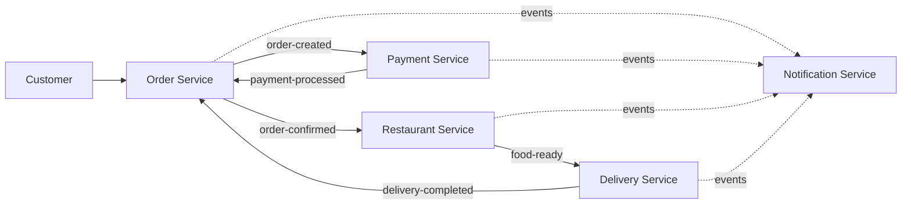

# Food Delivery Backend - Microservices Architecture

Event-driven microservices platform for a food delivery application, built with Node.js, Express, MongoDB, and Apache Kafka.

## 🏗️ Architecture Overview

This backend implements a **microservices architecture** with event-driven communication via Kafka, enabling scalable, loosely-coupled services.

### **Key Design Patterns:**
*   **Microservices:** Each service is independently deployable and scalable
*   **Event-Driven:** Services communicate asynchronously via Kafka topics
*   **Service Layer Pattern:** Clear separation between controllers, services, and repositories
*   **API Gateway Ready:** All services expose REST APIs with CORS support

### **Tech Stack**
*   **Runtime:** Node.js 20.x
*   **Framework:** Express.js 4.x/5.x
*   **Database:** MongoDB 5.0+ (via Mongoose ODM)
*   **Message Broker:** Apache Kafka (via KafkaJS)
*   **Authentication:** JWT (JSON Web Tokens)
*   **Payment Processing:** Stripe API
*   **Container:** Docker + Docker Compose

## 📦 Microservices

The platform consists of **6 independent microservices**, each with its own database and responsibilities:

| Service | Port | Database | Key Responsibilities | README |
|---------|------|----------|---------------------|--------|
| **User Service** | 5005 | MongoDB | Authentication, profiles, addresses, cart | [README](user-service/README.md) |
| **Order Service** | 5001 | MongoDB | Order creation, lifecycle, orchestration | [README](order-service/README.md) |
| **Payment Service** | 5002 | MongoDB | Stripe integration, payment processing | [README](payment-service/README.md) |
| **Restaurant Service** | 5006 | MongoDB | Restaurants, menus, kitchen orders | [README](restaurant-service/README.md) |
| **Delivery Service** | 5004 | MongoDB | Driver management, delivery assignments | [README](delivery-service/README.md) |
| **Notification Service** | 5003 | In-Memory | Event consumption, notification generation | [README](notification-service/README.md) |

> 📖 **For detailed setup, API endpoints, and configuration for each service, see their individual README files linked above.**

## 🎯 Event-Driven Workflow

Services communicate via **Kafka topics** to maintain loose coupling:



### **Kafka Topics**

| Topic | Publisher | Consumers | Purpose |
|-------|-----------|-----------|---------|
| `order-created` | Order Service | Payment Service | Trigger payment processing |
| `payment-processed` | Payment Service | Order Service | Confirm order after payment |
| `order-confirmed` | Order Service | Restaurant Service | Send order to kitchen |
| `food-ready` | Restaurant Service | Delivery Service | Assign driver when food ready |
| `delivery-assigned` | Delivery Service | Notification Service | Notify customer of driver |
| `delivery-picked-up` | Delivery Service | Notification Service | Update order status |
| `delivery-completed` | Delivery Service | Order Service | Mark order as delivered |

All events are also consumed by **Notification Service** for customer/driver/restaurant notifications.

## 🚀 Quick Start

### **Prerequisites**
*   **Node.js:** 20.x or higher
*   **Docker:** For MongoDB and Kafka
*   **npm:** 9.x or higher
*   **Stripe Account:** For payment processing (test mode API keys)

### **1. Install All Dependencies**

Install dependencies for all microservices:

```bash
cd Food-Delivery-Backend
npm run install-all
```

This will install dependencies for the backend root and all 6 microservices.

### **2. Start Infrastructure**

Start MongoDB, Kafka, and Zookeeper:

```bash
docker-compose up -d
```

Verify containers are running:
```bash
docker-compose ps
```

### **3. Seed Database**

Populate MongoDB with test data (users, restaurants, menu items, drivers):

```bash
npm run seed
```

This creates:
- 2 customers, 15 restaurant owners, 5 drivers
- 15 restaurants with full menus
- Sample addresses and test accounts

### **4. Start All Services**

Start all 6 microservices simultaneously:

```bash
npm run dev
```

This uses `concurrently` to run all services in parallel. You'll see color-coded output from each service.

**Alternative: Start Services Individually**

If you prefer to run services in separate terminals:

```bash
# Terminal 1
cd user-service && npm run dev

# Terminal 2
cd order-service && npm run dev

# Terminal 3
cd payment-service && npm run dev

# Terminal 4
cd restaurant-service && npm run dev

# Terminal 5
cd delivery-service && npm run dev

# Terminal 6
cd notification-service && npm run dev
```

### **5. Verify Services**

Check health endpoints:
```bash
curl http://localhost:5005/api/user-service/health      # User Service
curl http://localhost:5001/health                       # Order Service
curl http://localhost:5002/health                       # Payment Service
curl http://localhost:5006/health                       # Restaurant Service
curl http://localhost:5004/health                       # Delivery Service
curl http://localhost:5003/health                       # Notification Service
```

## 📝 Available NPM Scripts

From the `Food-Delivery-Backend` directory, you can use these npm scripts:

| Script | Command | Description |
|--------|---------|-------------|
| **Install All** | `npm run install-all` | Install dependencies for all 6 microservices |
| **Start All (Dev)** | `npm run dev` | Start all services in development mode using concurrently |
| **Seed Database** | `npm run seed` | Populate MongoDB with test data from `seed-mongodb.mjs` |
| **Start All (Prod)** | `npm start` | Start all services in production mode |

**Individual Service Scripts:**

Each service directory has these scripts:
- `npm run dev` - Start service with nodemon (auto-restart)
- `npm start` - Start service in production mode


## 🎓 Service Layer Pattern

All services follow a **3-layer architecture** for clean code organization:

```
Service/
├── controllers/     # HTTP request handling, input validation
├── services/        # Business logic, orchestration
├── repositories/    # Database operations (Mongoose)
├── routes/          # Express route definitions
├── middleware/      # Auth, validation, error handling
├── handlers/        # Kafka event handlers
├── utils/           # Helper functions, logger
└── config/          # DB, Kafka, service configuration
```

**Benefits:**
- Clear separation of concerns
- Easier testing and mocking
- Reusable business logic
- Simplified controller logic

## 🔒 Security Features

*   **JWT Authentication:** Stateless token-based auth with refresh tokens
*   **Password Hashing:** bcrypt with salt rounds
*   **Role-Based Access Control:** Customer, restaurant, driver roles
*   **Rate Limiting:** Protection against brute-force attacks
*   **CORS:** Configurable origin whitelisting
*   **Helmet:** Security headers
*   **Input Validation:** Express-validator + Mongoose schemas

## 🔧 Configuration

Each service requires a `.env` file. Example for User Service:

```env
PORT=5005
MONGODB_URI=mongodb://localhost:27017/food-delivery
JWT_SECRET=your-secret-key
KAFKA_BROKERS=localhost:9092
```

> 📖 **See individual service READMEs for complete environment variable documentation.**

## 📊 API Standardization

All APIs follow consistent conventions:

### **Response Format**
```json
{
  "success": true,
  "data": { ... },
  "message": "Operation successful"
}
```

### **Naming Conventions**
*   **Case:** camelCase for all JSON fields
*   **Primary Keys:** All entities use `id` (mapped from MongoDB `_id`)
*   **Foreign Keys:** `userId`, `orderId`, `restaurantId`, etc.
*   **Timestamps:** ISO 8601 format (`createdAt`, `updatedAt`)

### **HTTP Status Codes**
*   `200` - Success
*   `201` - Created
*   `400` - Bad Request
*   `401` - Unauthorized
*   `403` - Forbidden
*   `404` - Not Found
*   `500` - Internal Server Error

## 🧪 Test Accounts

**Customers:**
- `john@example.com` / `password`
- `jane@example.com` / `password`

**Restaurant Owners:**
- `mario@pizzapalace.com` / `password` (Mario's Pizza Palace)
- `burger@junction.com` / `password` (Burger Junction)
- `thai@garden.com` / `password` (Thai Garden)

**Drivers:**
- `sarah.johnson@driver.com` / `password`
- `john.smith@driver.com` / `password`
- `mike.davis@driver.com` / `password`

## 🐳 Docker Deployment

Each service includes a `Dockerfile` for containerization.

**Build all services:**
```bash
# From project root
./build-docker-images.sh  # Linux/Mac
# or
./build-docker-images.ps1  # Windows
```

**Run with Docker Compose:**
```bash
docker-compose -f docker-compose-full.yml up -d
```

## 📝 Available Scripts

From backend root directory:

*   `node seed-mongodb.mjs` - Seed database with test data
*   `npm run start-all` - Start all services (requires pm2)
*   `docker-compose up -d` - Start infrastructure (MongoDB, Kafka)
*   `docker-compose down` - Stop infrastructure

## 🔧 Troubleshooting

### **Kafka Connection Issues**
```bash
# Check Kafka is running
docker-compose ps

# View Kafka logs
docker-compose logs kafka

# Restart Kafka
docker-compose restart kafka
```

### **MongoDB Connection Issues**
```bash
# Check MongoDB is running
docker-compose ps mongodb

# Connect to MongoDB shell
docker exec -it food-delivery-mongodb mongosh

# View databases
show dbs
use food-delivery
show collections
```

### **Service Won't Start**
1. Check port isn't already in use: `netstat -ano | findstr :5005`
2. Verify `.env` file exists and has required variables
3. Ensure MongoDB and Kafka are running
4. Check service logs for errors

### **Events Not Publishing/Consuming**
1. Verify Kafka broker is running
2. Check topic names match across services
3. Look for Kafka connection errors in service logs
4. Ensure Kafka consumer/producer are initialized

## 📚 Documentation

*   **Service READMEs:** Each service directory contains detailed documentation
*   **API Endpoints:** Documented in individual service READMEs
*   **Kafka Topics:** See Event-Driven Workflow section above
*   **Database Schemas:** Defined in service `models/` directories

## 🛠️ Development Tools

**Recommended:**
*   **MongoDB Compass:** GUI for MongoDB
*   **Kafka Tool / Conduktor:** Kafka topic visualization
*   **Postman:** API testing
*   **VS Code:** With ES Lint and Prettier extensions

## 🚦 Service Dependencies

```
User Service (Standalone)
    ↓
Order Service → Restaurant Service (menu validation)
    ↓
Payment Service → Order Service, Restaurant Service (Stripe)
    ↓
Restaurant Service → Order Service (kitchen orders)
    ↓
Delivery Service → (Kafka events only)
    ↓
Notification Service → All services (consumes all events)
```

## 📈 Scalability Considerations

*   **Horizontal Scaling:** Services are stateless and can be scaled horizontally
*   **Database Sharding:** Each service has its own MongoDB database
*   **Kafka Partitioning:** Topics can be partitioned for parallel processing
*   **Load Balancing:** Use nginx or cloud load balancers for multiple instances
*   **Caching:** Add Redis for frequently accessed data (future enhancement)

## 🎯 Future Enhancements

- [ ] API Gateway (Kong/NGINX) for unified entry point
- [ ] Service mesh (Istio) for advanced traffic management
- [ ] Distributed tracing (Jaeger/Zipkin)
- [ ] Centralized logging (ELK stack)
- [ ] Real-time WebSocket notifications
- [ ] GraphQL federation across services
- [ ] Database replication for high availability

---

**For detailed service documentation, refer to individual service READMEs.**